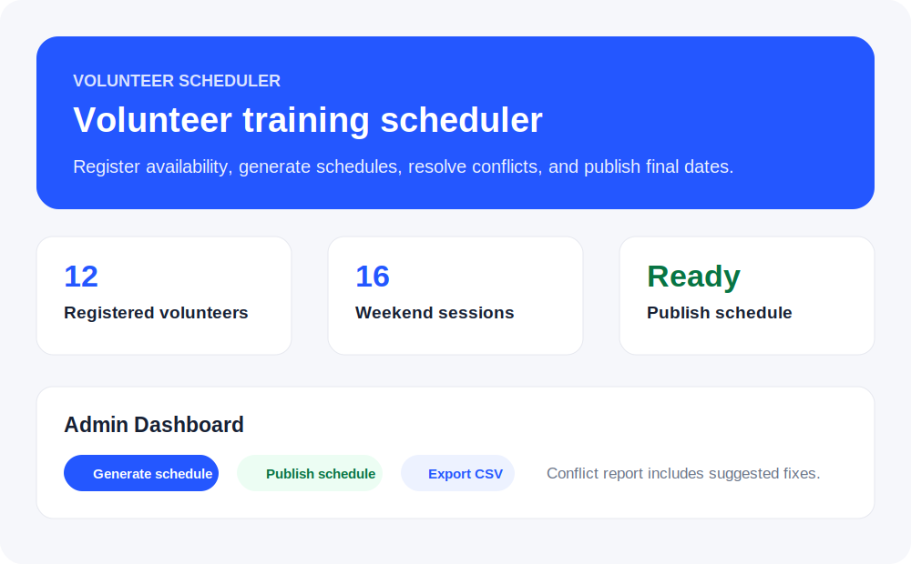

# Volunteer Scheduler Demo

A polished static front-end demo for a volunteer training scheduling platform.



## Why this demo is useful

This prototype shows the core client workflow for a 4-month weekend volunteer training programme:

- Volunteers register once and submit availability.
- Duplicate registrations are blocked by email.
- Admin users can review volunteers, capacities, and generated assignments.
- The scheduler attempts to assign exactly 8 sessions per volunteer.
- Session capacity limits are respected.
- Conflicts are explained with suggested fixes.
- Admin users can publish the final schedule.
- Volunteers can look up their assigned dates after publication.
- Admin users can export the schedule as CSV.

## Demo features

### Public volunteer experience

- Polished landing section explaining the system benefits
- Volunteer registration form
- Weekend availability checklist
- Volunteer schedule lookup by email
- Draft versus published schedule status

### Admin experience

- Admin login mockup
- Dashboard unlock state
- Editable session capacities
- Registered volunteer table
- Automatic schedule generation
- Publish schedule button
- Improved conflict report with suggested fixes
- CSV export
- Demo reset

## Screenshot

The repository includes a lightweight SVG mock screenshot at:

```text
assets/demo-screenshot.svg
```

For a production proposal, replace this SVG with real browser screenshots or a short GIF showing:

1. Volunteer registration
2. Admin schedule generation
3. Conflict report
4. Publish schedule
5. Volunteer schedule lookup

## Demo data

The app stores data in browser `localStorage`. Use **Load sample volunteers** to populate demo records.

## Run locally

Open `index.html` directly in your browser.

## Deploy on GitHub Pages

1. Open the repository on GitHub.
2. Go to **Settings**.
3. Select **Pages**.
4. Under **Build and deployment**, choose **Deploy from a branch**.
5. Select the `main` branch and `/root` folder.
6. Save.

GitHub Pages will publish the demo as a public website.

## Files

- `index.html` — page structure and demo sections
- `styles.css` — responsive styling and dashboard states
- `app.js` — demo data, validation, scheduling, publishing, lookup, and CSV export logic
- `assets/demo-screenshot.svg` — README preview image

## Backend and database plan

This front-end demo is intentionally static. A production version should add the following backend architecture.

### Recommended stack

- Frontend: React, Vue, or server-rendered templates
- Backend: Node.js/Express, Python FastAPI, Laravel, or Django
- Database: PostgreSQL
- Authentication: email/password, magic links, or organization SSO
- Email: SendGrid, Mailgun, Amazon SES, or SMTP
- Scheduler: OR-Tools or a backend constraint-solving service
- Hosting: Render, Railway, Fly.io, Vercel plus managed database, or a VPS

### Core database tables

#### volunteers

| Field | Purpose |
|---|---|
| id | Primary key |
| full_name | Volunteer name |
| email | Unique email, used to prevent duplicates |
| phone | Contact number |
| emergency_contact | Optional safety contact |
| created_at | Registration timestamp |

#### training_sessions

| Field | Purpose |
|---|---|
| id | Primary key |
| session_date | Training date |
| capacity | Maximum number of volunteers |
| status | open, full, cancelled, locked |

#### availability

| Field | Purpose |
|---|---|
| volunteer_id | Linked volunteer |
| session_id | Linked session |
| available | Boolean |

#### assignments

| Field | Purpose |
|---|---|
| volunteer_id | Linked volunteer |
| session_id | Assigned session |
| status | draft, published, changed |
| assigned_by | system or admin |

#### admins

| Field | Purpose |
|---|---|
| id | Primary key |
| email | Admin login email |
| password_hash | Secure password hash |
| role | admin or viewer |

### Production workflow

1. Admin creates training dates and capacity limits.
2. Volunteers register and select availability.
3. Backend validates duplicate emails and minimum availability.
4. Admin runs the scheduler.
5. Scheduler creates draft assignments.
6. Admin reviews conflicts and suggested fixes.
7. Admin manually adjusts if required.
8. Admin publishes the schedule.
9. Volunteers receive email notifications and can view their assigned dates.
10. Admin exports final records for attendance tracking.

### Scheduling engine plan

The current demo uses a simple greedy approach. For production, use a constraint solver with these rules:

- Each volunteer must be assigned exactly 8 sessions.
- A volunteer can only be assigned to sessions they selected as available.
- Session assignment count must not exceed session capacity.
- The solver should prioritize volunteers with fewer available dates.
- The solver should balance attendance across sessions where possible.
- If no perfect solution exists, the system should return clear conflict reasons.

### Security and reliability requirements

- Store all data server-side, not in `localStorage`.
- Use HTTPS.
- Hash admin passwords.
- Validate all inputs on the server.
- Protect admin routes with authentication.
- Add audit logs for schedule changes.
- Add backup and restore procedures.
- Add rate limiting to public forms.
- Add email verification or magic links for volunteer schedule lookup.

## Notes

This repository is a front-end prototype designed to convince stakeholders and validate the workflow. It should not be used with real personal data until a backend, authentication, secure storage, and production-grade scheduling are added.
